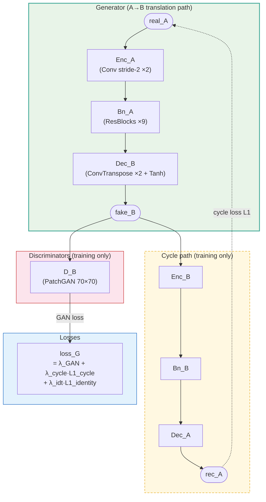
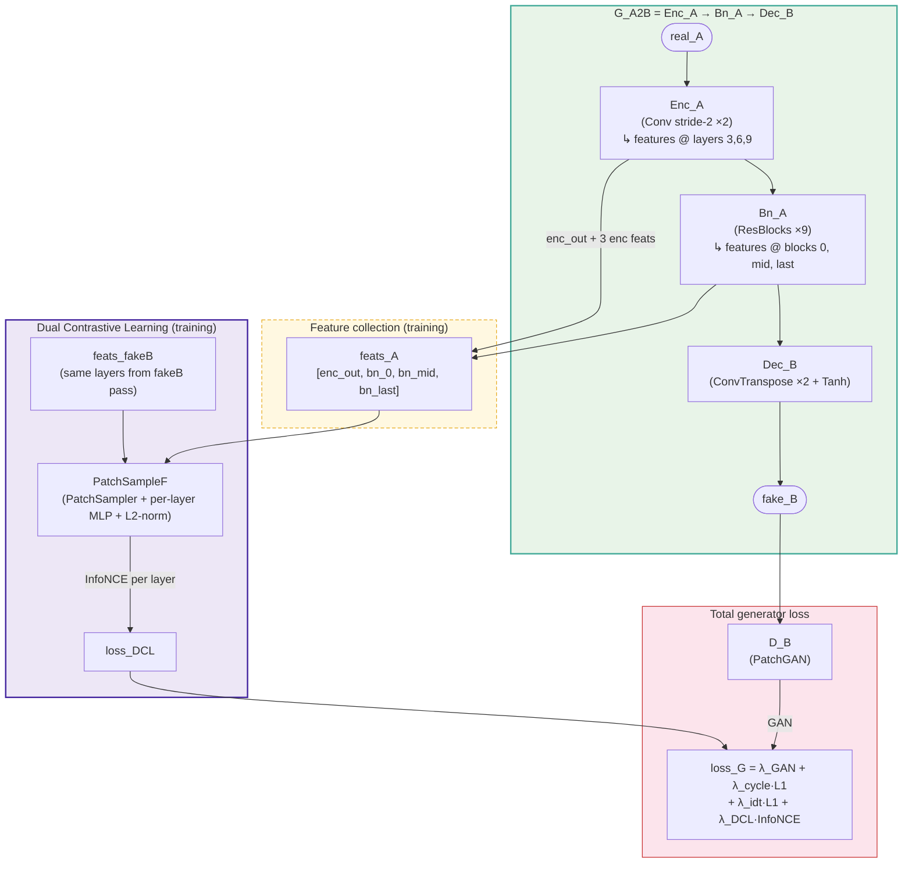
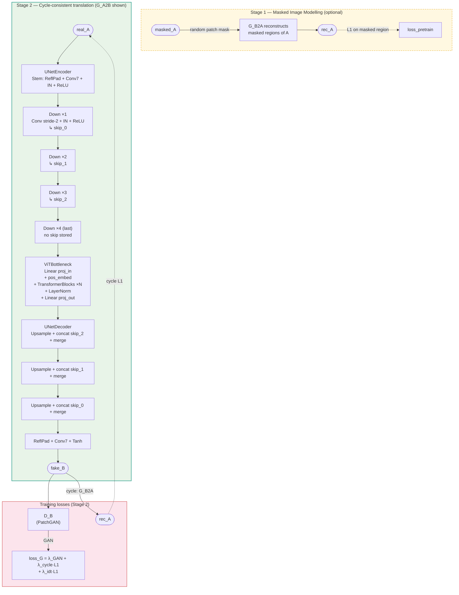
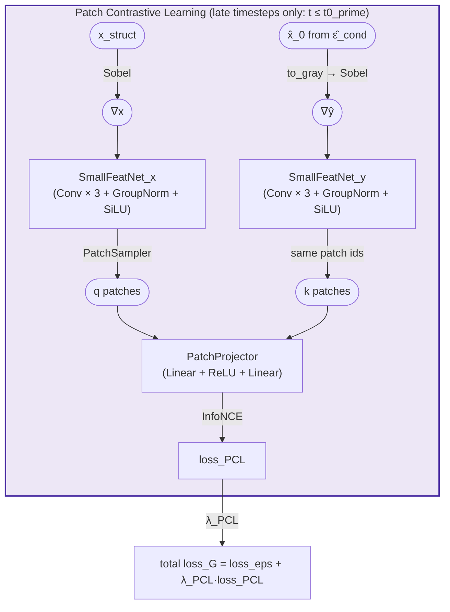
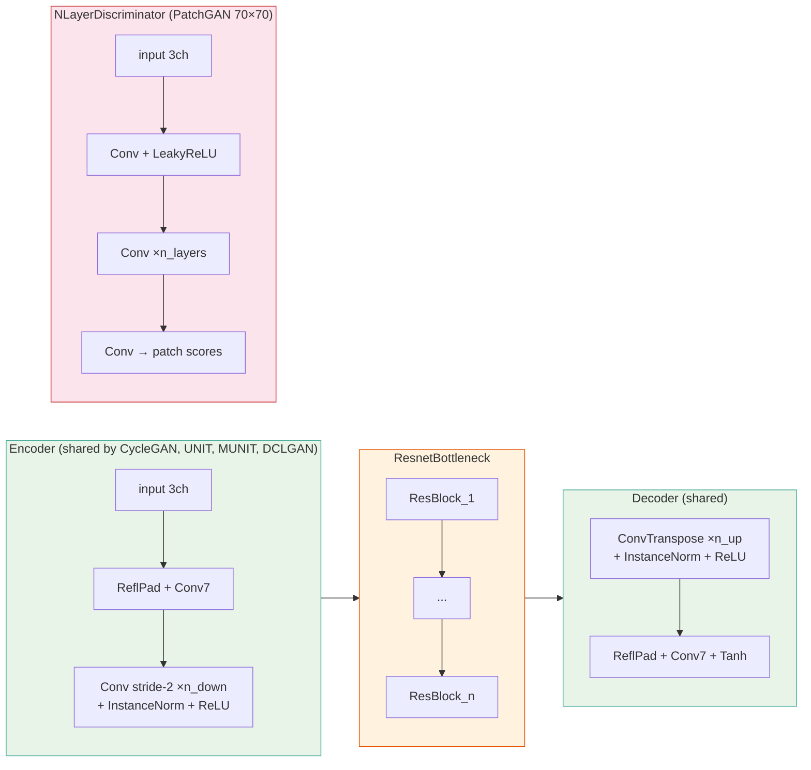

# Model Architecture Diagrams

Mermaid.js diagrams for all six models in I2I-Stain-Zoo.
Each diagram shows the **A→B translation path** at inference, plus the discriminators and loss signals used during training.

---

## 1. CycleGAN

Split-encoder design. Two fully-independent generator paths share no weights. A replay buffer (ImagePool) stabilises discriminator training.



---

## 2. UNIT

Shared bottleneck enforces domain-invariant representation. The variational reparameterisation adds KL regularisation. Both domains pass through the **same** shared ResBlocks.

```mermaid
flowchart TD
    subgraph EncoderA ["Domain A encoder"]
        xA([real_A]) --> EA["E_A\n(Conv stride-2 ×2)"]
        EA --> LatA["LatentHeads_A\n(1×1 Conv → μ_A, logvar_A)"]
        LatA -->|reparameterise z~N(μ,σ²)| zA([z_A])
    end

    subgraph EncoderB ["Domain B encoder"]
        xB([real_B]) --> EB["E_B\n(Conv stride-2 ×2)"]
        EB --> LatB["LatentHeads_B\n(1×1 Conv → μ_B, logvar_B)"]
        LatB -->|reparameterise| zB([z_B])
    end

    subgraph Bottleneck ["Bottleneck (A→B path shown)"]
        zA --> PreA["bn_pre_A\n(private ResBlocks)"]
        PreA --> Shared["bn_shared\n(shared weights ←→ both domains)"]
        Shared --> PostB["bn_post_B\n(private ResBlocks)"]
    end

    subgraph Decoder ["Decoder"]
        PostB --> DecB["Dec_B\n(ConvTranspose ×2 + Tanh)"]
        DecB --> fakeB([fake_B])
    end

    subgraph Training ["Training signals"]
        fakeB --> DB["D_B\n(PatchGAN)"]
        DB -->|GAN| LG["loss_G = λ_GAN + λ_recon·L1 + λ_KL·KL"]
        LatA -.->|KL loss| LG
    end

    style EncoderA fill:#e8f4e8,stroke:#4a9,stroke-width:2px
    style EncoderB fill:#e8f4e8,stroke:#4a9,stroke-width:2px
    style Bottleneck fill:#fff3e0,stroke:#e65100,stroke-width:2px
    style Decoder fill:#e8f4e8,stroke:#4a9,stroke-width:2px
    style Training fill:#fce4ec,stroke:#c62828,stroke-width:1px
```

---

## 3. MUNIT

Disentangles content (spatial structure) and style (global appearance). At inference, style can be sampled randomly for multimodal output, or extracted from a reference image.

```mermaid
flowchart TD
    subgraph EncodeA ["Encode domain A"]
        xA([real_A]) --> EcA["Ec_A\n(Conv stride-2 ×2)"]
        EcA --> BnA["Bn_A\n(content ResBlocks)"]
        BnA --> cA([content_A])
        xA --> EsA["Es_A\n(Conv ×3 + GlobalPool + FC)"]
        EsA --> sA([style_A])
    end

    subgraph Translate ["Translate A→B"]
        cA --> AdaINB["AdaIN_B\n(ResBlocks with style injection)"]
        sB_rand([s_B ~ N&#40;0,1&#41;\nor style ref]) -->|StyleMLP → γ,β per block| AdaINB
        AdaINB --> DecB["Dec_B\n(ConvTranspose ×2 + Tanh)"]
        DecB --> fakeB([fake_B])
    end

    subgraph ReEncode ["Re-encode for consistency (training)"]
        fakeB --> EcB2["Ec_B"]
        EcB2 --> BnB2["Bn_B"]
        BnB2 --> cA_hat([content_A_hat])
        fakeB --> EsB2["Es_B"]
        EsB2 --> sB_hat([style_B_hat])
    end

    subgraph Losses ["Losses (training)"]
        cA_hat -.->|content recon L1| cA
        sB_hat -.->|style recon L1| sB_rand
        fakeB --> DB["D_B\n(PatchGAN)"]
        DB -->|GAN| LG["loss_G = λ_GAN + λ_img·L1\n+ λ_content·L1 + λ_style·L1"]
    end

    style EncodeA fill:#e8f4e8,stroke:#4a9,stroke-width:2px
    style Translate fill:#fff3e0,stroke:#e65100,stroke-width:2px
    style ReEncode fill:#fff8e1,stroke:#e6a817,stroke-width:1px,stroke-dasharray:5 3
    style Losses fill:#fce4ec,stroke:#c62828,stroke-width:1px
```



---

## 4. DCLGAN

CycleGAN backbone augmented with **Dual Contrastive Learning (DCL)**. Feature maps at multiple depths are sampled as patches and pulled together via InfoNCE, encouraging structural consistency without an explicit cycle.



---

## 5. UVCGAN

UNet generator with a **Vision Transformer (ViT) bottleneck**. Skip connections preserve spatial detail; the ViT models long-range relationships at the bottleneck. Supports an optional masked-image pretraining stage.



---

## 6. MIUDiff

Three-stage conditional diffusion model. Stage 1 trains an unconditional DDPM on domain B. Stage 2 adds a conditional UNet guided by the source image and mutual information. Stage 3 adds patch-contrastive refinement.

### Stage 1 — Unconditional Pretraining (`eps_uncond`)

```mermaid
flowchart LR
    subgraph Forward ["Forward process q(y_t | y_0)"]
        y0([y_0 ~ domain B]) -->|add noise α̅_t| yT([y_t])
    end

    subgraph UNet ["Unconditional UNet: eps_uncond"]
        yT --> UNC["DDPMUNet\nin: y_t &#40;3ch&#41; + t_frac\n\nEncoder: ResBlocks + Downsample\nMid: ResBlock + Attention + ResBlock\nDecoder: ResBlock + Upsample + skip-concat"]
        UNC --> eps_pred(["ε̂_uncond"])
    end

    subgraph MI ["MI Estimator (separate optimiser)"]
        y0 -->|Sobel grad| gy(["∇y_0"])
        gy --> MINet["MIEstimator\n(patch MLP)"]
        y0 --> MINet
        MINet -->|MINE lower bound| MI_loss["loss_MI\n(separate backward)"]
    end

    subgraph Loss ["Diffusion loss"]
        eps_pred -.->|MSE vs ε| loss_eps["loss_eps = MSE(ε̂, ε)"]
    end

    style Forward fill:#e3f2fd,stroke:#1565c0,stroke-width:1px
    style UNet fill:#e8f4e8,stroke:#4a9,stroke-width:2px
    style MI fill:#ede7f6,stroke:#4527a0,stroke-width:1px,stroke-dasharray:5 3
    style Loss fill:#fce4ec,stroke:#c62828,stroke-width:1px
```



### Stage 2 — Conditional Finetuning (`eps_cond`)

```mermaid
flowchart LR
    subgraph Input ["Inputs"]
        xA([real_A]) -->|to_gray| xStruct([x_struct &#40;1ch&#41;])
        y0([y_0 ~ domain B]) -->|add noise| yT([y_t &#40;3ch&#41;])
        yT --> concat([concat: y_t ⊕ x_struct &#40;4ch&#41;])
        xStruct --> concat
    end

    subgraph UNet ["Conditional UNet: eps_cond"]
        concat --> COND["DDPMUNet\nin: y_t ⊕ x_struct &#40;4ch&#41; + t_frac\n\nSame architecture as eps_uncond\nbut extra input channel for conditioning"]
        COND --> eps_pred(["ε̂_cond"])
    end

    subgraph Loss ["Loss"]
        eps_pred -.->|MSE vs ε| loss_eps["loss_eps + optional λ_PCL·InfoNCE"]
    end

    subgraph Inference ["DDIM sampling (inference)"]
        noise([z ~ N&#40;0,I&#41;]) -->|T denoising steps| DDIM["DDIM loop\nε̂ = guidance_scale·ε̂_cond\n       + &#40;1−guidance_scale&#41;·ε̂_uncond"]
        xStruct2([x_struct]) --> DDIM
        DDIM --> fakeB([fake_B])
    end

    style Input fill:#e3f2fd,stroke:#1565c0,stroke-width:1px
    style UNet fill:#e8f4e8,stroke:#4a9,stroke-width:2px
    style Loss fill:#fce4ec,stroke:#c62828,stroke-width:1px
    style Inference fill:#fff8e1,stroke:#e6a817,stroke-width:2px
```



### Stage 3 — PCL Refinement (optional, added on top of Stage 2)



---

## Shared building blocks (`base_models.py`)


