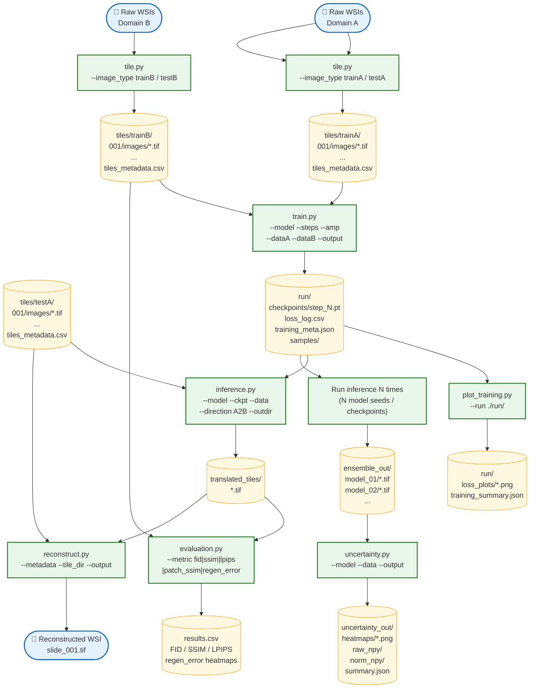
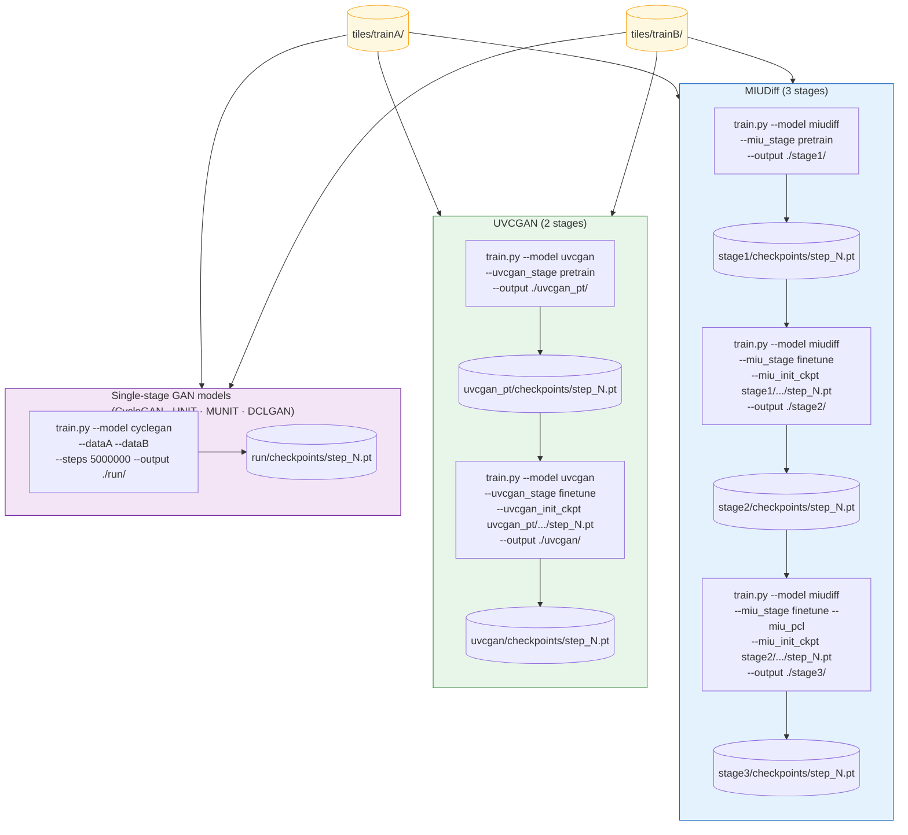
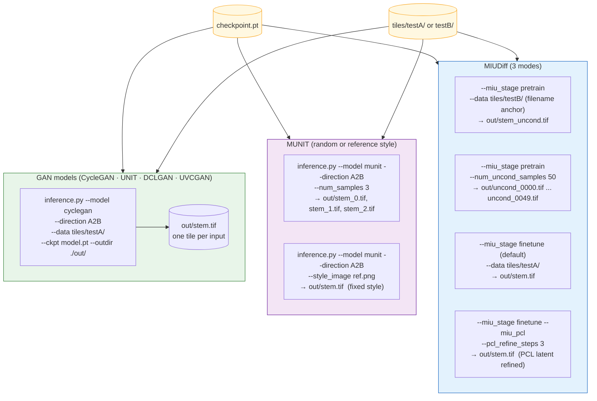
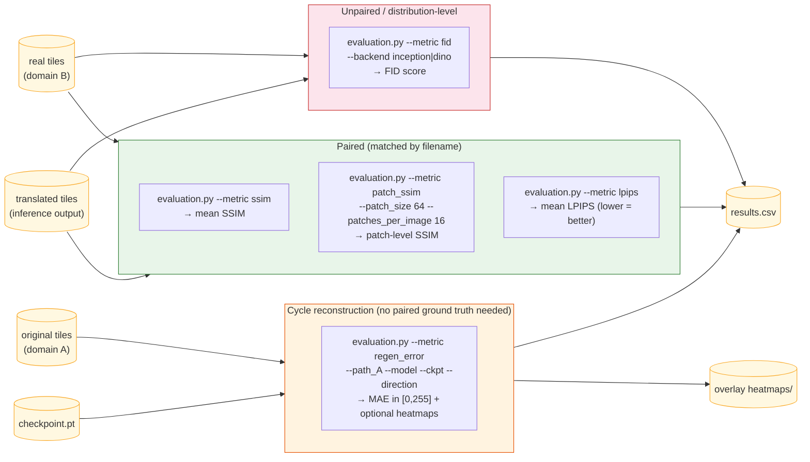
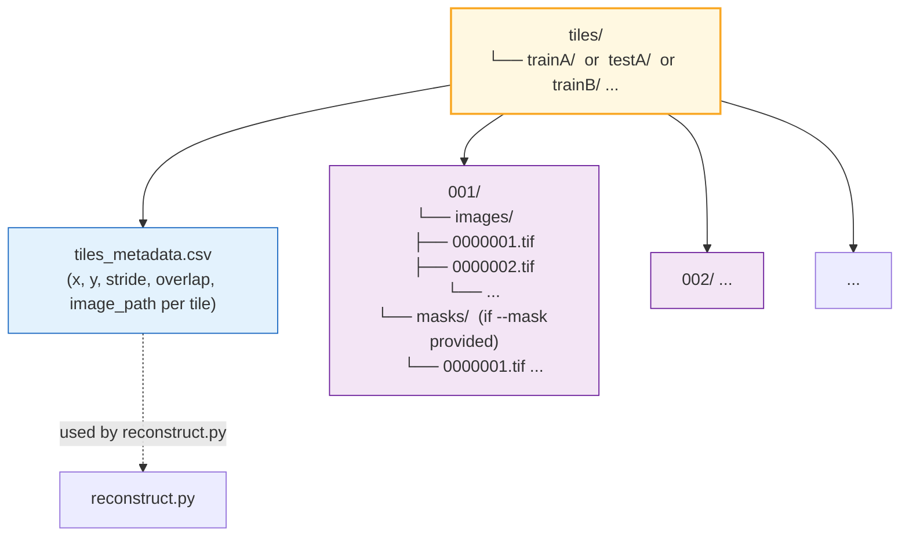

# CLI Pipeline Flowchart

End-to-end flow from raw WSI files to evaluation results and reconstructed whole-slide images.

---

## Full Pipeline Overview

---

## Multi-stage Training Detail

For models with a pretrain stage (**MIUDiff**, **UVCGAN**), the `train.py` step expands into multiple runs, each with its own output directory.

---

## Inference Modes

---

## Evaluation Metrics

---

## Tile directory structure (output of `tile.py`)

