# Diffusion Models — Architecture Diagrams

All four diffusion models share the same `DDPMUNet` backbone and linear noise schedule
(`beta_start=1e-4`, `beta_end=2e-2`, `T=1000`) but differ in conditioning strategy,
loss composition, and training stages.

**Colour key (all diagrams)**
- Blue border — Domain A input
- Orange border — Domain B input
- Green border — sampled noise / random
- Purple border — neural network
- Red border — loss term

---

## Shared: DDIM Denoising Step

One iteration of the reverse loop used at inference by all four models:

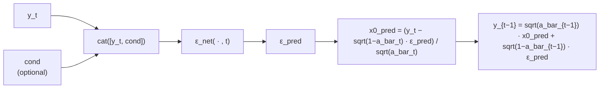

---

## MIUDiff

Three-stage training. Stage 1 builds an unconditional domain-B prior. Stage 2 adds
conditional A→B translation. Stage 3 adds patch contrastive loss (PCL).
Stage 2 weights are warm-started from stage 1 (`eps_uncond → eps_cond`, extra
conditioning channel initialised from channel mean).

---

### MIUDiff — Stage 1 Training (Unconditional DDPM on B)

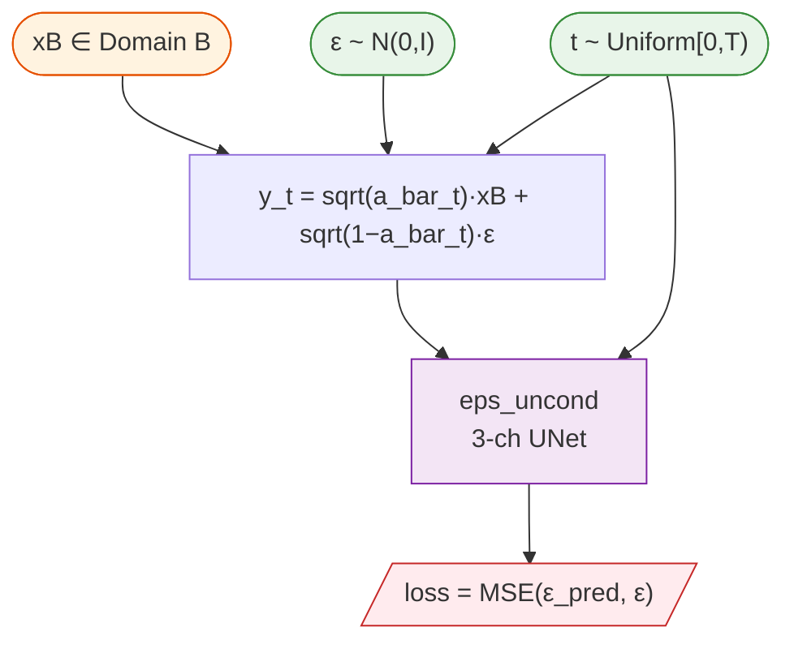

---

### MIUDiff — Stage 2 Training (Conditional + optional struct loss)

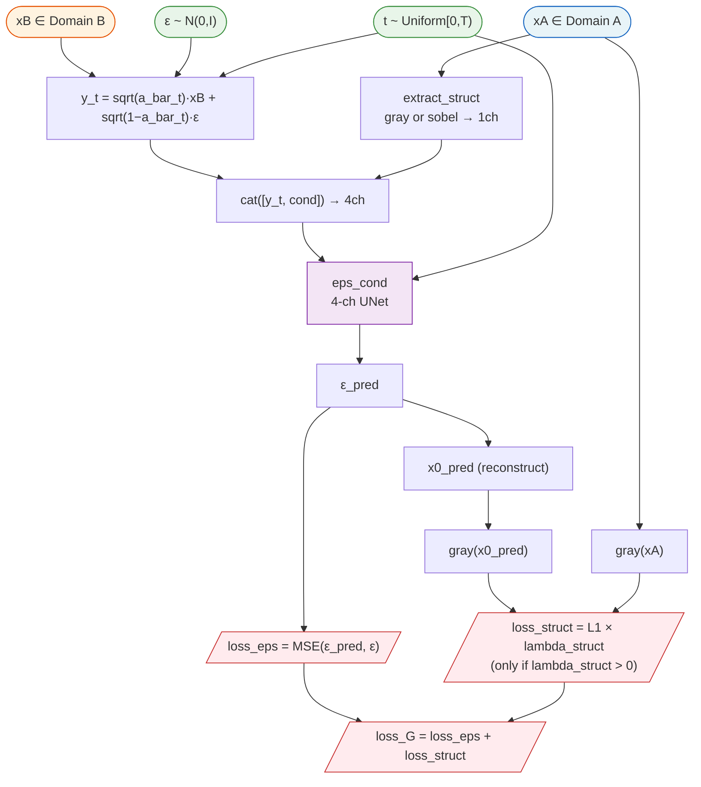

---

### MIUDiff — Stage 3 Training (Conditional + struct + PCL)

Stage 3 loads the stage-2 checkpoint directly (no weight copying). PCL is applied at
**all** timesteps during training; `t0_prime` thresholding is inference-only.

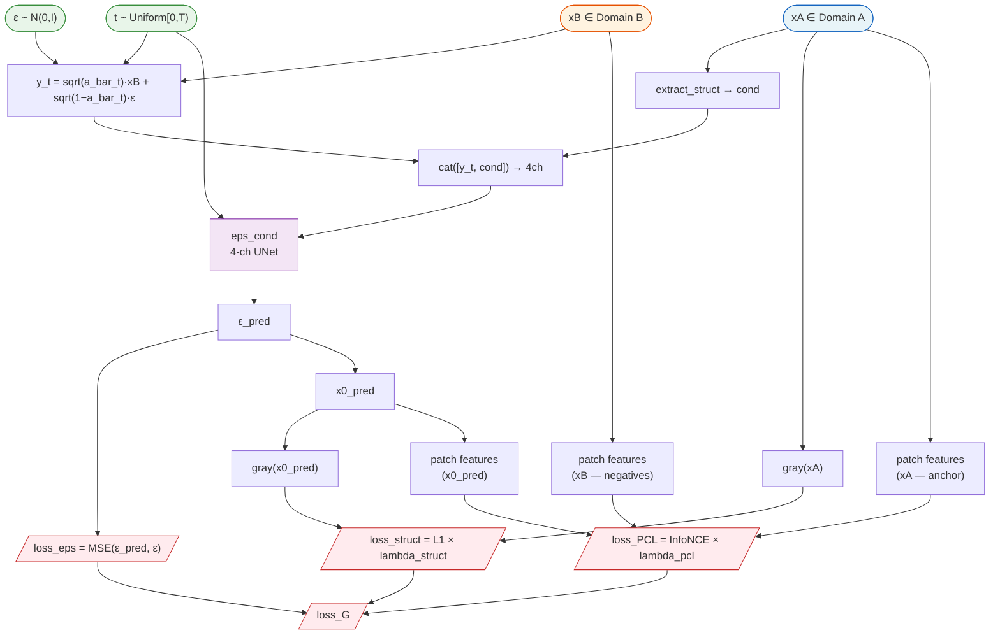

---

### MIUDiff — Inference

`--miu_stage pretrain` uses only `eps_uncond` (unconditional sampling from B prior).
`--miu_stage finetune` uses `eps_cond` with optional MI guidance and PCL refinement.

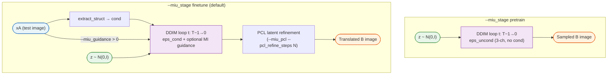

---

## UNIT-DDPM

Two-stage training. Architecture is identical to MIUDiff but without MI guidance or PCL.
Default conditioning is full RGB (`cond_type=rgb`); `gray` and `sobel` are available.
Stage 2 warm-starts `eps_cond` from the stage-1 `eps_uncond` weights.

---

### UNIT-DDPM — Stage 1 Training (Unconditional DDPM on B)

Identical to MIUDiff Stage 1.

---

### UNIT-DDPM — Stage 2 Training (Conditional A→B)

`cond_type=rgb` → 6-ch input. `cond_type=gray` or `sobel` → 4-ch input.

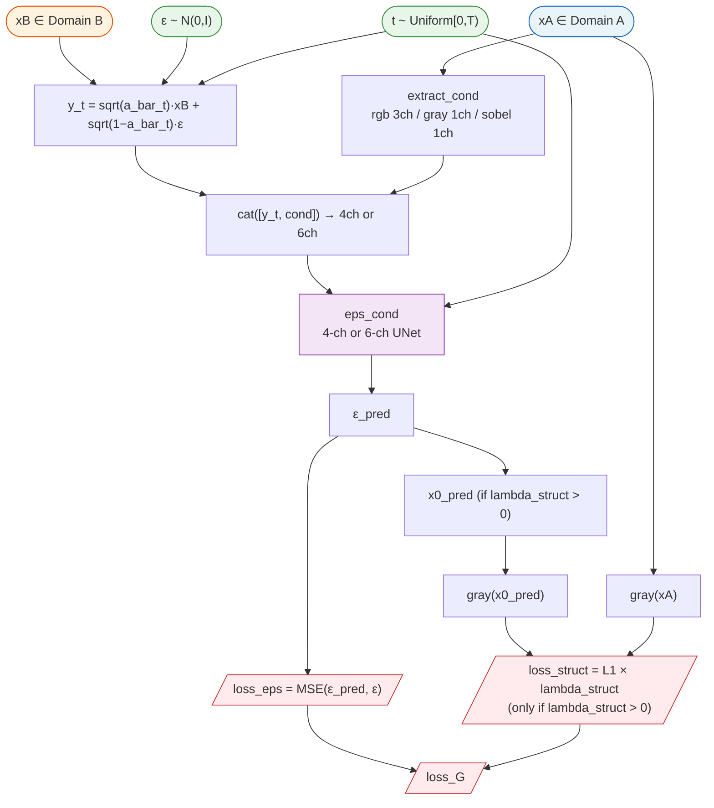

---

### UNIT-DDPM — Inference

Always uses `eps_cond`. Starts from pure Gaussian noise (no SB-style initialisation).

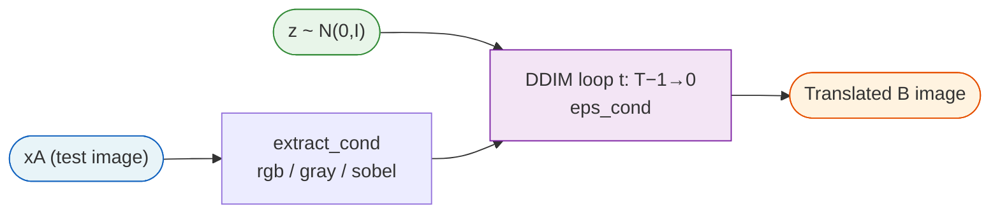

---

## CycleDiffusion

Single-stage joint training of two fully unconditional DDPMs, one per domain.
No spatial conditioning — structure is transferred implicitly via the shared
DDIM noise latent. No discriminator, no cycle loss.

---

### CycleDiffusion — Training (Joint, Single Stage)

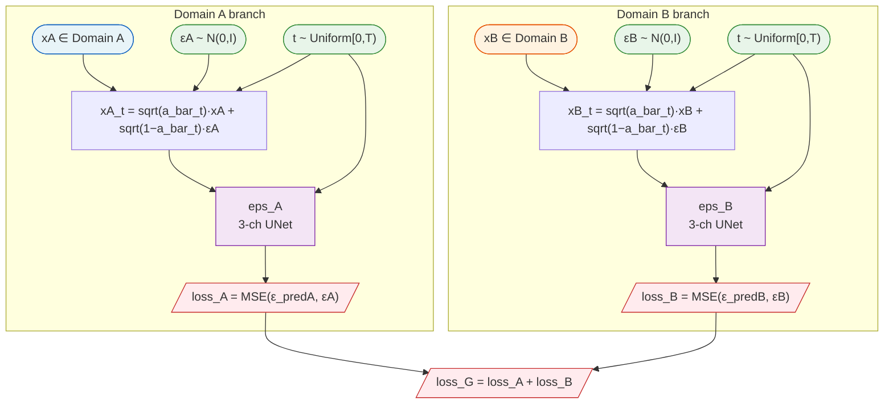

---

### CycleDiffusion — Inference A→B

DDIM inversion runs the forward process (t: 0→T−1) deterministically using `eps_A`
to encode xA into a noise code `z`. DDIM decode then runs the reverse process
(t: T−1→0) using `eps_B` to reconstruct an image in domain B from the same `z`.
B→A is symmetric (swap eps_A ↔ eps_B).

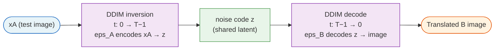

---

## UNSB

Single-stage training. Score network `z_theta` takes noisy domain-B images
conditioned on xA and predicts the added noise. An adversarial discriminator
pushes the predicted clean image `x0_pred` toward the domain-B distribution.
Both losses pull in the same direction: score matching anchors `x0_pred` to xB,
adversarial reinforces the B distribution boundary.

---

### UNSB — Training

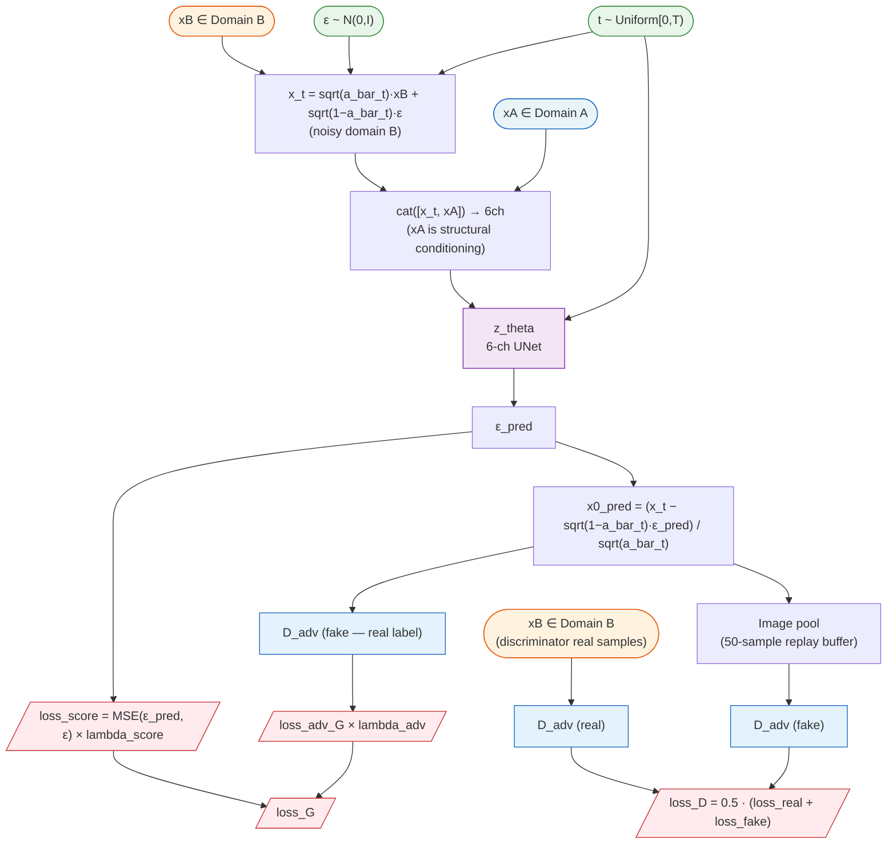

---

### UNSB — Inference A→B

The SB initial distribution starts from heavily-noised xA. Because `a_bar_{T-1} ≈ 0`
at t = T−1, the xA contribution is negligible (≈1%) and the starting point is
effectively pure Gaussian noise. `z_theta` is conditioned on xA at every step.

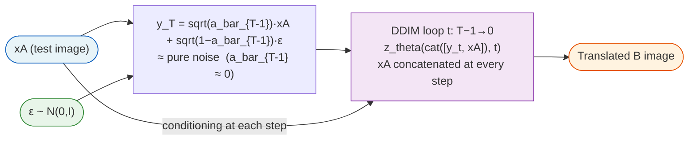

---

## Model Comparison

| | MIUDiff | UNIT-DDPM | CycleDiffusion | UNSB |
|---|---|---|---|---|
| **Stages** | 3 | 2 | 1 | 1 |
| **Score matching target** | xB | xB | xA and xB (separate) | xB |
| **Conditioning input** | gray/sobel xA (1ch) | rgb/gray/sobel xA | None | rgb xA (3ch) |
| **Adversarial loss** | No | No | No | Yes (on x0_pred) |
| **Structural alignment** | MI guidance + optional L1 + PCL | optional L1 | Shared noise latent | Adversarial only |
| **Inference start** | Pure noise | Pure noise | Noisy xA (DDIM invert) | ≈ Pure noise |
| **Unpaired-safe** | Partially (MI guidance helps) | Limited | Yes | Limited |
